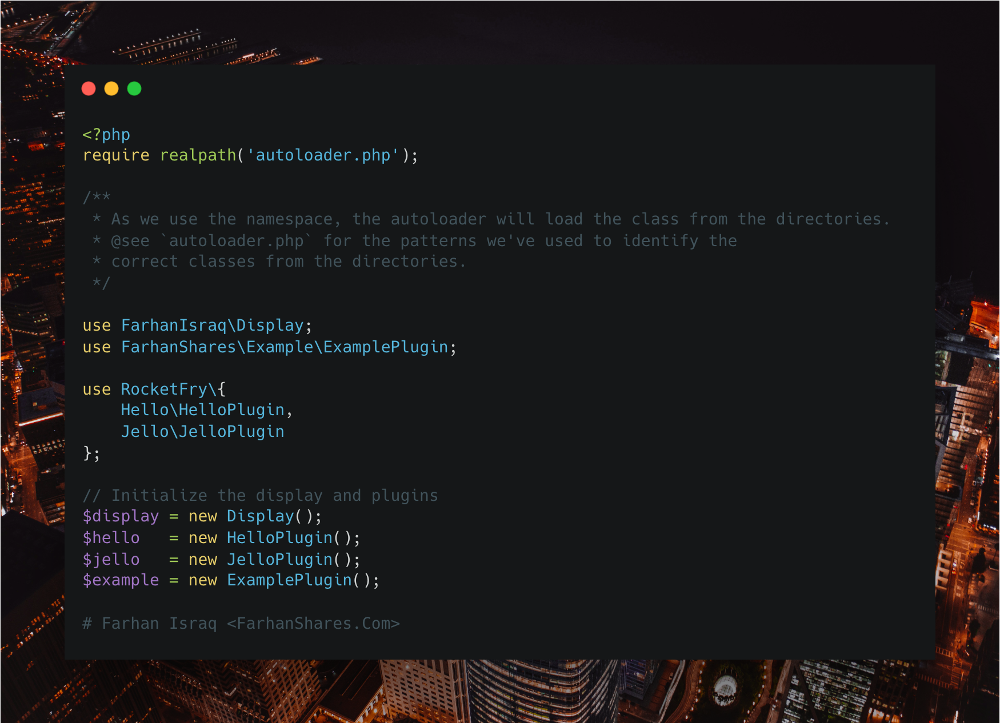

# PHP Autoloader Hands-On Crush Course by FarhanShares.Com

This is a hands-on crash course on how to build a PHP autoloader.

## How to navigate the codebase?

- `index.php` is the entry point of the application.
- `autoloader.php` is the heart of the application that makes the magic happen.
- `plugins/` is where all the plugins live.
- `src/` is where all the application components live.

## How to use the application?

- Run `php index.php` to see the autoloader in action.
- Open `index.php` along with `autoloader.php` and follow the comments to understand how the autoloader works.

## Visual Learner?

- Video tutorial coming soon!
<!-- - Watch the video tutorial on [YouTube](https://www.youtube.com/watch?v=) -->
