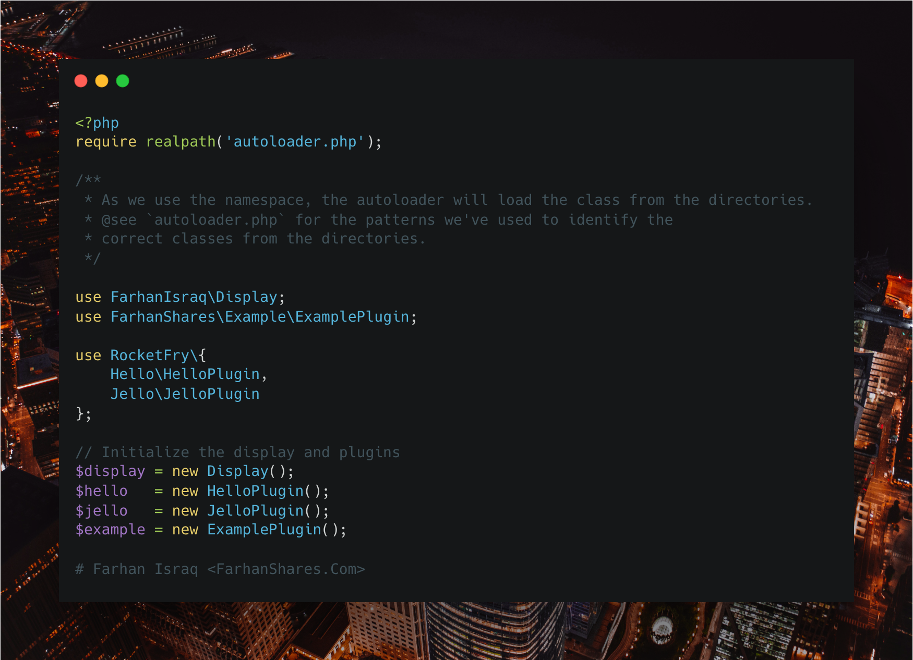

# How to implement a PHP Autoloader for a Plugin System? [Part 1]

--

Before we want a plugin system, we must know how do we load (autoload) all the plugin codes it provides. Then we need a structure how the plugin is going to interact.

To begin with, PHP provides spl_autoload_register() function, which accepts a Closure to implement how should the files be loaded.

We may use different patterns to identify the correct files to load.

For example, we may use the namespace prefix or the directory structure to identify the correct files to load, such as -

1. If a class is in the namespace `FarhanIsraq`, then the autoloader will look for the file in the `src` directory.

2. If a file ends with `Plugin`, then the autoloader will look for the file in the `plugins` directory.

And so on. You may want to check the GitHub repository for the full implementation in a simplified way here: https://github.com/FarhanShares/php-autoloader-tutorial

A video tutorial is coming soon!

Hashtags: #PHP #Programming #Developer #Engineer #OpenSource #Tutorial
